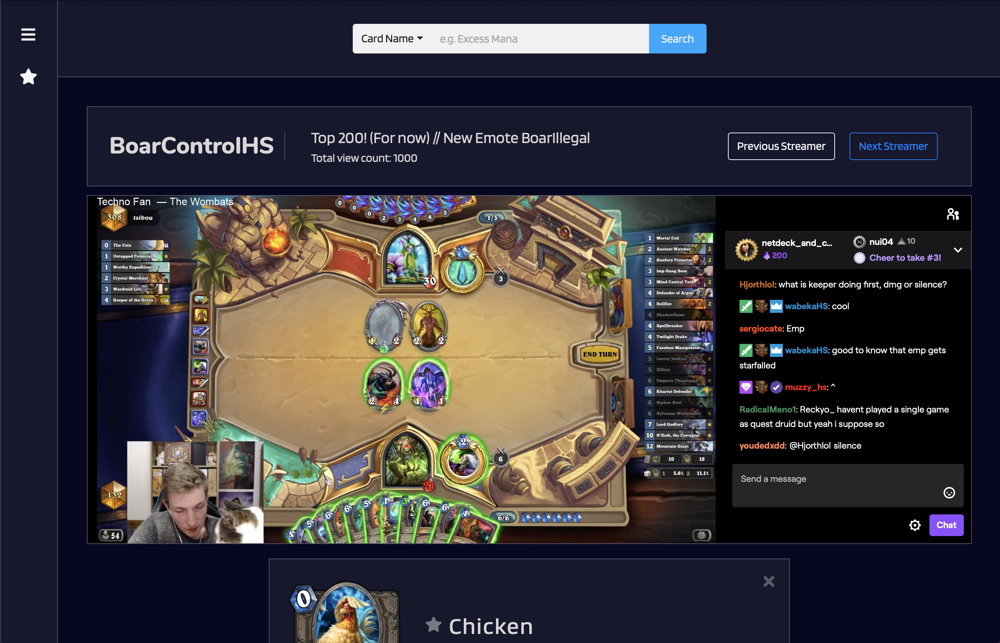
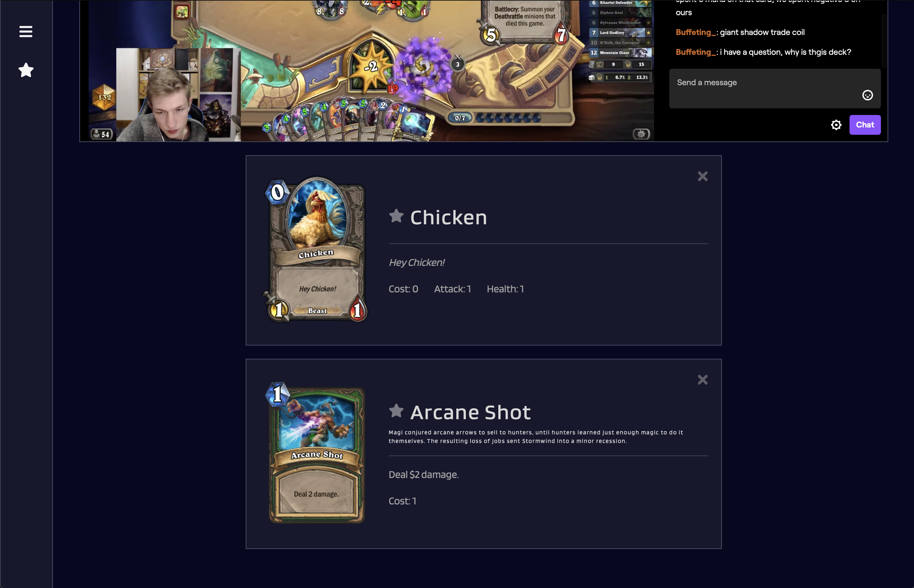

# Hearthstone Helper
## Overview
Hearthstone helper is a web application designed to help users learn the popular online card game Hearthstone.

## Built with
- html5
- CSS3
- javascript
- [Twitch.tv API](https://dev.twitch.tv) - Twitch.tv development portal
- [Hearthstone API](https://hearthstoneapi.com) - Hearthstone card database

## Views

### Landing page
Hearthstone Helper is a simple web app with several options when the user loads the page.
1. At the top of the page, the user has a search bar which will query for cards by name. After searching, more information about the card will be appended below.
2. The user has two options at the left of the page.
  - The star is for favorited cards for ease of access.
  - The hamburger is a table of contents page explaining some of the rules of the game.
3. The middle of the page is the Twitch.tv API incorporated portion of the page displaying the current most popular streamer. The user also has the option to cycle through the top 10 most popular streamers at the time.

## Authors
See the list of [contributors](https://github.com/Mezran/Hearthstone-Helper/graphs/contributors) who participated in this project along with individual commit history.

copyright 2019 &copy; Stephen Allen
